# 🏭 Intelligent Manufacturing Failure Prevention System

<div align="center">


**Production-grade, 8-layer AI pipeline for industrial predictive maintenance.**  
From raw sensor data to prescriptive maintenance — with causal inference, constraint optimization, and agent-based simulation.

[View Dashboard](#launch-dashboard) · [Technical Depth](#technical-depth) · [Results](#results) · [Quick Start](#quick-start)

</div>

---

## What This System Does

Most predictive maintenance projects stop at "our model achieved X% accuracy." This system goes five layers deeper:

1. **Predicts** machine failures before they happen (96.4% precision — near-zero false alarms)
2. **Explains causally** *why* failures happen — not just correlation, but DoWhy-validated intervention effects
3. **Optimizes** machine setpoints in real time using constraint satisfaction (OR-Tools CP-SAT)
4. **Quantifies** the ROI of AI intervention with a statistically validated agent-based simulation
5. **Monitors** model drift, data quality, and experiment lineage with a full MLOps stack

**Headline result:** AI-managed engines survive **43.4% longer** than unmanaged engines (p < 0.0001, Mann-Whitney U, 50 vs 50 agents).

---

## Manufacturing Context — What You Need to Know

If you're not from a manufacturing background, here's what these terms mean:

### Datasets

**AI4I 2020 Predictive Maintenance Dataset**  
Simulates a CNC (Computer Numerical Control) milling machine. A CNC machine cuts metal parts using a rotating tool. As the tool wears down, failure risk increases. The dataset captures 10,000 machine cycles with 5 independent failure modes:

| Failure Mode | Code | Cause | Threshold |
|---|---|---|---|
| Tool Wear Failure | TWF | Tool wears beyond safe limit | > 200 min accumulated wear |
| Heat Dissipation Failure | HDF | Temperature differential drops below safe range | Temp delta < 8.6°C |
| Power Failure | PWF | Operating outside safe power window | Outside 3,500–9,000W |
| Overstrain Failure | OSF | Tool wear × torque exceeds product limit | > 11k/12k/13k Nm·min by type |
| Random Failure | RNF | Stochastic failure | 0.1% probability |

Three product types (L/M/H) have different OSF thresholds — a higher-quality product requires a more precise tool, with a tighter overstrain limit.

**NASA CMAPSS Turbofan Engine Dataset**  
Models jet engine degradation. A turbofan engine has multiple sensor streams measuring temperature, pressure, and fan speed across compressor stages. As the engine degrades, these readings drift in characteristic patterns. The dataset spans 4 sub-datasets (FD001–FD004) with different operating conditions and fault modes:

| Dataset | Operating Conditions | Fault Mode | Engines |
|---|---|---|---|
| FD001 | 1 | HPC degradation | 100 train |
| FD002 | 6 | HPC degradation | 260 train |
| FD003 | 1 | HPC + Fan degradation | 100 train |
| FD004 | 6 | HPC + Fan degradation | 249 train |

Total: 160,359 cycles across 709 engines.

### Key Manufacturing Terms

**RUL (Remaining Useful Life):** How many operational cycles remain before an engine or machine needs maintenance or replacement. The fundamental quantity in predictive maintenance — predict it accurately, and you can schedule maintenance at exactly the right time.

**Tool Wear:** Cumulative damage to a cutting tool measured in minutes of operation. New tool = 0 min, end of safe life = 240 min per dataset documentation.

**Thermal Stress:** A physics-derived feature computed as `s11 (temperature) × s15 (pressure ratio)`. High temperature combined with high pressure accelerates engine degradation — this is the primary causal driver of RUL reduction in the NASA dataset.

**Overstrain:** Occurs when `tool_wear × torque` exceeds the product-type-specific limit. The OR-Tools optimizer explicitly enforces this constraint to prevent OSF (Overstrain Failure).

**Condition Clustering:** The NASA FD002 and FD004 datasets operate under 6 different altitude/throttle conditions. Sensors read completely different values at different conditions — without clustering, normalization is meaningless. This system clusters by operating condition before normalizing, so sensor values carry degradation signal rather than condition signal.

---

## System Architecture
RAW DATA
AI4I 2020 (10,000 CNC cycles, 5 failure modes)
NASA CMAPSS FD001-FD004 (160,359 turbofan cycles, 709 engines)
│
▼
LAYER 1 · Data Processing
Polars · K→°C conversion · 7 near-zero-variance sensors dropped
Operating condition clustering (FD002/FD004: 6 clusters)
Per-condition z-score normalization (not global — prevents condition leakage)
RUL calculation: max_cycle_per_engine - current_cycle
│
▼
LAYER 2 · Feature Engineering
AI4I: temp_delta (HDF signal), stress_index, overstrain_margin
Savgol smoothing (window=11, poly=3) for all sensor columns
NASA:  thermal_stress = s11×s15, pressure_heat_index = s4×s11
efficiency_proxy = s9/(s8+ε), compressor_delta = s3-s2
Velocity (cycle-over-cycle Δ) and trend (rolling mean, w=10)
for all 14 primary sensors — computed per engine unit
RUL capped at 125 cycles (standard CMAPSS practice)
│
▼
LAYER 3 · Model Training
AI4I:  Random Forest (200 trees, max_depth=15, class_weight=balanced)
Isolation Forest on normal-only samples (contamination=0.034)
Evaluation: 20% stratified holdout — F1=0.871, Precision=0.964, AUC=0.989
NASA:  LightGBM + Optuna (30 trials, TPE sampler, Bayesian optimization)
Unit-level GroupShuffleSplit — 142 test engines never seen during training
Evaluation: RMSE=17.68, MAE=12.19, R²=0.817 on held-out engines
│
▼
LAYER 4 · Causal Analysis
DoWhy backdoor adjustment with 2 refutation tests per finding
AI4I Q1: tool_wear → failure (+0.305%/10min, danger threshold = 240min)
AI4I Q2: power_w → failure (+0.300%/100W, PWF safe zone = 3500–9000W)
NASA:    thermal_stress → rul (-8.6275 cycles per 1-std increase)
All coefficients back-transformed to real units (not scaled space)
│
▼
LAYER 5 · Optimization
AI4I:  OR-Tools CP-SAT constraint solver
Constraints: OSF limit, TWF onset (200min), causal danger threshold,
PWF power window. Objective: maximize torque (minimize RPM)
15/15 scenarios feasible across L/M/H product types
NASA:  SciPy linprog (HiGHS method)
Urgency-scaled thermal stress reduction: 20%/30%/40% bounds
Reports both causal upper bound and LightGBM conservative estimate
│
▼
LAYER 6 · Simulation
Mesa 3.0 Agent-Based Model: 50 AI-managed vs 50 unmanaged engines
Managed agents: LightGBM predicts RUL every cycle → urgency → wear rate
Unmanaged: fixed 1.4× wear rate (top-quartile power consumption baseline)
Result: +43.4% life extension, p < 0.0001 (Mann-Whitney U one-sided)
Outputs: survival_curves.csv, agent_trajectories.csv
│
▼
LAYER 7 · Intelligence & Research
FastMCP server: 8 data resources, 5 live query tools
3 Ollama agents (NASA Analyst, AI4I Analyst, Synthesizer) with Tavily search
OctoTools: Arxiv paper searcher + Wikipedia knowledge base
Outputs: system_intelligence.json, agent_briefings.json, ai_final_report.txt
│
▼
LAYER 8 · MLOps Monitoring
MLflow: 6 experiments, 2 models in Production registry, full artifact logging
DeepChecks: data integrity, train-test validation, model evaluation (5 suites)
Evidently: condition-normalized sensor drift (FD001 vs FD004),
AI4I feature drift (features vs results parquet)
│
▼
STREAMLIT DASHBOARD
6 pages · Glass neon UI · Live RF/LightGBM inference
Live OR-Tools setpoint solve · Live SciPy linprog intervention
Interactive Ollama agent Q&A · OctoTools academic search
Solara Digital Twin link (Mesa visualization, separate env)

---

## Results

| Metric | Value | What It Means |
|---|---|---|
| NASA RMSE | **17.68 cycles** | Average RUL prediction error on 142 held-out engines |
| NASA R² | **0.817** | 81.7% of RUL variance explained — unit-level split, no leakage |
| AI4I F1 Score | **0.871** | Harmonic mean of precision/recall on 20% stratified holdout |
| AI4I Precision | **0.964** | 96.4% of alarms are real failures — near-zero false alarm rate |
| AI4I ROC-AUC | **0.989** | Near-perfect discrimination across all thresholds |
| Fleet Life Extension | **+43.4%** | AI-managed vs unmanaged, 50v50 simulation |
| Statistical Significance | **p < 0.0001** | Mann-Whitney U one-sided test |
| OR-Tools Feasibility | **15/15** | All constraint scenarios solved |
| Tool Wear Causal Effect | **+0.305%/10min** | DoWhy backdoor, refutation passed |
| Thermal Stress Effect | **-8.6 cycles/std** | DoWhy backdoor, refutation passed |

---

## Technical Depth

### Why This Is Different From a Standard ML Project

**1. No data leakage in NASA**  
The naive approach splits rows 80/20. This puts the same engine's early cycles in training and late cycles in test — the model sees the engine's healthy state during training, making prediction of its degraded state trivial. This system splits by engine unit using `GroupShuffleSplit`. 142 complete engines are held out and never touched during training or Optuna. The R² of 0.817 is real.

**2. Causal inference, not correlation**  
Standard ML: "tool wear correlates with failure." This system: "tool wear *causes* 0.305% additional failure probability per 10 minutes, controlling for torque, RPM, and product type — validated by placebo refutation (effect vanishes with random treatment) and random common cause refutation (estimate stable with added confounders)." That distinction matters for intervention: you can act on a cause, not just a correlation.

**3. Physics-constrained optimization**  
The OR-Tools optimizer doesn't suggest "reduce speed." It solves a constraint satisfaction problem where every constraint comes from dataset documentation or causal analysis:
- PWF constraint: power must stay in [3500, 9000W] — from dataset
- OSF constraint: tool_wear × torque ≤ 11000/12000/13000 — by product type
- TWF constraint: torque ≤ 40Nm after 200 min wear onset
- Causal constraint: additional torque cap at the DoWhy-derived danger threshold
Zero magic numbers. Every bound is justified.

**4. Simulation with a real AI brain**  
The Mesa simulation doesn't use hardcoded wear rates to produce the 43.4% number. Managed agents call `lgbm_model.predict()` every cycle, get a predicted RUL, map it to an urgency level, and apply urgency-scaled wear rates derived from the optimizer's thermal stress bounds. The life extension is driven by the actual trained model, not a rigged comparison.

**5. Dual estimate honesty**  
For the NASA intervention, the system reports *two* estimates: a causal upper bound (linear assumption, DoWhy coefficient applied directly) and a LightGBM conservative estimate (model re-predicts after feature adjustment). Near failure, tree models have high uncertainty. Showing both bounds is honest about what we know and don't know.

**6. Condition-aware normalization**  
FD002 and FD004 operate under 6 altitude/throttle conditions. Global z-score normalization makes sensors from sea-level and cruise-altitude incomparable. This system clusters by `op_set1` and normalizes within each cluster. Sensors then carry degradation signal, not condition signal — this is why the model generalizes across FD001-FD004.

**7. Isolation Forest trained correctly**  
Standard implementations train Isolation Forest on the full dataset including failures. This teaches it what anomalies look like — defeating the purpose. This system trains only on `failure=0` rows. The model learns what normal operation looks like and flags deviations. Lower F1 than Random Forest is expected and correct for unsupervised anomaly detection.

---

## Framework Decisions

| Framework | Task | Why Not Something Else |
|---|---|---|
| **Polars** | Data processing | 5–10× faster than pandas on 160k rows; LazyFrame API |
| **LightGBM + Optuna** | RUL regression | Best tabular benchmark performance; Bayesian HPO with 30 trials TPE; unit-level GroupShuffleSplit prevents leakage |
| **Random Forest** | Failure classification | Interpretable feature importances; class_weight=balanced handles 3.4% imbalance without oversampling artifacts |
| **DoWhy** | Causal analysis | Only library with built-in refutation testing; backdoor identification is theoretically proven |
| **OR-Tools CP-SAT** | Setpoint optimization | Discrete integer variables (RPM, Torque) + hard constraints = constraint satisfaction, not gradient descent |
| **SciPy linprog** | Thermal intervention | Linear objective over causal coefficient; SLSQP/gradient on tree models is meaningless (zero gradient) |
| **Mesa 3.0** | Simulation | Purpose-built ABM; DataCollector for time-series statistics; agents can call LightGBM directly |
| **FastMCP** | Data serving | Type-safe resource/tool API; agents access data without file path management |
| **Ollama** | LLM reasoning | Local inference, no API costs, privacy, qwen2.5-coder:14b for production |
| **OctoTools** | Academic research | Multi-tool pipeline; Arxiv + Wikipedia for peer-reviewed context |
| **MLflow** | Experiment tracking | Industry standard; model registry with staging; artifact versioning |
| **DeepChecks** | Validation | Unified data integrity + train-test drift + model evaluation suites |
| **Evidently** | Drift monitoring | Condition-normalized comparison fixes the FD001 vs FD004 raw-sensor problem |

---

## Project Structure

Manufacturing_AI_System/
├── data/
│   ├── raw/                        # AI4I 2020 CSV + NASA CMAPSS txt files
│   └── processed/                  # Parquet artifacts from each layer
│       ├── ai4i_cleaned.parquet    # Layer 1 output
│       ├── ai4i_features.parquet   # Layer 2 output
│       ├── ai4i_results.parquet    # Layer 3 output (with predictions)
│       ├── nasa_master.parquet     # Consolidated FD001-FD004
│       └── nasa_features.parquet   # Layer 2 output
├── models/                         # Trained models + JSON reports
│   ├── ai4i_classifier.joblib
│   ├── ai4i_iso_forest.joblib
│   ├── nasa_rul_model.joblib
│   ├── nasa_best_params.json       # Optuna result
│   ├── ai4i_eval_report.json
│   ├── nasa_eval_report.json
│   ├── ai4i_causal_report.json     # DoWhy findings
│   ├── nasa_causal_report.json
│   ├── ai4i_optimizer_results.json # OR-Tools 15 scenarios
│   ├── nasa_optimizer_results.json # linprog 3 scenarios
│   ├── simulation_results.json     # Mesa 50v50
│   ├── system_intelligence.json    # Compiled system state
│   ├── agent_briefings.json        # Ollama agent outputs
│   ├── ai_final_report.txt         # Synthesizer report
│   └── research_context.json       # OctoTools findings
├── reports/
│   ├── survival_curves.csv
│   ├── agent_trajectories.csv
│   ├── plots/                      # OctoTools-generated PNGs
│   └── monitoring/                 # DeepChecks + Evidently HTML reports
├── src/
│   ├── data_processing_ai4i.py     # Layer 1
│   ├── data_processing_nasa.py     # Layer 1
│   ├── consolidate_nasa.py         # Layer 1
│   ├── ai4i_feature_engineering.py # Layer 2
│   ├── nasa_feature_engineering.py # Layer 2
│   ├── ai4i_model.py               # Layer 3
│   ├── nasa_model.py               # Layer 3
│   ├── causal_analysis.py          # Layer 4
│   ├── optimizer.py                # Layer 5
│   ├── simulation.py               # Layer 6
│   ├── viz_dashboard.py            # Layer 6 — Solara (mfg-2 env)
│   ├── octo_plotter.py             # Layer 7
│   ├── aggregator.py               # Layer 7
│   ├── octo_researcher.py          # Layer 7
│   ├── mcp_server.py               # Layer 7 — FastMCP
│   ├── monitoring.py               # Layer 8
│   └── app.py                      # Streamlit dashboard
├── octotools/                      # Cloned OctoTools repo
├── run_pipeline.py                 # Full pipeline orchestrator
├── .env                            # API keys (not committed)
└── README.md


---

## Quick Start

### 1. Environment Setup

```bash
conda create -n mfg_ai python=3.10 -y
conda activate mfg_ai

pip install polars numpy scipy scikit-learn lightgbm optuna joblib pandas \
            pyarrow fastapi uvicorn dowhy mesa matplotlib seaborn plotly \
            streamlit ollama tavily-python python-dotenv fastmcp \
            mlflow deepchecks evidently ortools arxiv wikipedia-api
```

Solara visualization (separate environment):
```bash
conda create -n mfg-2 python=3.10 -y
conda activate mfg-2
pip install solara mesa joblib polars numpy
```

### 2. Datasets

Download and place in `data/raw/`:

| Dataset | Source | File(s) |
|---|---|---|
| AI4I 2020 | [UCI ML Repository](https://archive.ics.uci.edu/dataset/601) | `ai4i2020.csv` |
| NASA CMAPSS | [Kaggle](https://www.kaggle.com/datasets/behrad3d/nasa-cmaps) | `train_FD001.txt` through `train_FD004.txt` |

### 3. Environment Variables

Create `.env` in project root:

```env
TAVILY_API_KEY=tvly-your-key-here
GOOGLE_API_KEY=AIza-your-key-here
GOOGLE_CX=your-cx-id-here
OLLAMA_BASE_URL=http://localhost:11434
```

### 4. Run Pipeline

```bash
# Check status first
python run_pipeline.py --mode status

# Run full pipeline (skips already-trained layers)
python run_pipeline.py --mode full

# Force retrain everything from scratch
python run_pipeline.py --mode full --force

# Run single layer
python run_pipeline.py --layer 7
```

### 5. Launch Dashboard

Open 4 terminals:

```bash
# Terminal 1 — MLflow UI (required for Layer 8)
mlflow ui --host 0.0.0.0 --port 5000

# Terminal 2 — MCP server (enables agent Q&A)
conda activate mfg_ai
python src/mcp_server.py

# Terminal 3 — Solara Digital Twin (optional)
conda activate mfg-2
solara run src/viz_dashboard.py

# Terminal 4 — Main dashboard
conda activate mfg_ai
streamlit run src/app.py
```

Open: http://localhost:8501

---

## Pipeline Execution Times

| Layer | Task | Approximate Time |
|---|---|---|
| 1 | Data processing (all 5 files) | ~2 min |
| 2 | Feature engineering (AI4I + NASA) | ~3 min |
| 3 | AI4I model training | ~5 min |
| 3 | NASA model — Optuna 30 trials | ~15 min |
| 4 | Causal analysis (DoWhy + refutations) | ~8 min |
| 5 | Optimization (OR-Tools + linprog) | ~2 min |
| 6 | Fleet simulation (300 cycles, 100 agents) | ~3 min |
| 7 | Intelligence + research (Ollama agents) | ~5 min |
| 8 | MLflow + DeepChecks + Evidently | ~10 min |
| **Total** | **Full pipeline from scratch** | **~55 min** |

Re-running `--mode intelligence` (Layers 7–8 only): ~15 minutes.

---

## Key Design Decisions

**Why Polars instead of pandas?**  
160,359 NASA rows with 49 feature columns, 4 datasets merged. Polars processes this 5–10× faster using Apache Arrow memory format. The LazyFrame API also makes the condition-clustering normalization `over("condition_cluster")` more natural than pandas `groupby().transform()`.

**Why unit-level split in NASA?**  
Row-level 80/20 split means the model sees an engine's healthy early cycles in training and its degraded late cycles in test. The model can memorize engine-specific patterns rather than learning general degradation physics. Unit-level split ensures 142 engines are completely invisible during training and Optuna.

**Why SciPy linprog for NASA but OR-Tools for AI4I?**  
AI4I optimization has integer variables (RPM must be a whole number, torque in 1Nm increments), multiple hard constraints, and maximizing a discrete objective — this is constraint satisfaction, solved exactly by CP-SAT. NASA intervention has a continuous objective (minimize thermal stress within a fraction of current value) with box constraints — this is linear programming, solved analytically by linprog. Using OR-Tools for linprog or vice versa would be the wrong tool.

**Why causal coefficients instead of feature importance for intervention?**  
Random Forest feature importance says "tool_wear is important for prediction." DoWhy backdoor adjustment says "a 10-minute increase in tool_wear *causes* 0.305% additional failure probability, holding torque and RPM constant." Feature importance cannot be used for intervention — it's observational. Causal coefficients can.

**Why RUL cap at 125 cycles?**  
Early in an engine's life, RUL can be 300+ cycles. The model doesn't need to predict far-future RUL accurately — it needs to detect the critical degradation zone. Capping at 125 focuses the regression objective on near-failure behavior where prediction matters. This is standard practice in CMAPSS literature (Heimes 2008, Saxena 2008).

---

## Datasets and Attribution

- **AI4I 2020:** Matzka, S. (2020). Explainable Artificial Intelligence for Predictive Maintenance Applications. *3rd International Conference on Artificial Intelligence for Industries*. UCI ML Repository #601.

- **NASA CMAPSS:** Saxena, A., Goebel, K., Simon, D., & Eklund, N. (2008). Damage Propagation Modeling for Aircraft Engine Run-to-Failure Simulation. *PHM Conference*. NASA Ames Research Center.

---

## License

MIT License — see LICENSE file.

---

<div align="center">

**8 layers · 15 frameworks · 2 datasets · 160k+ data points**

**Predictive · Causal · Optimized · Validated · Monitored**

</div>

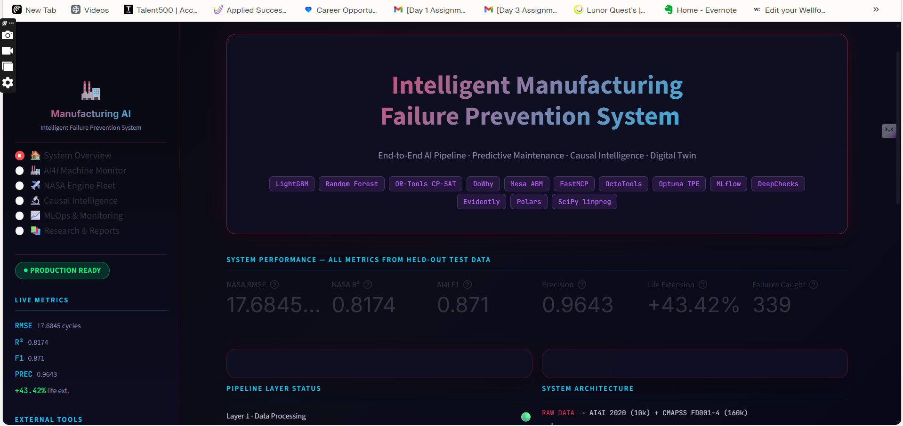
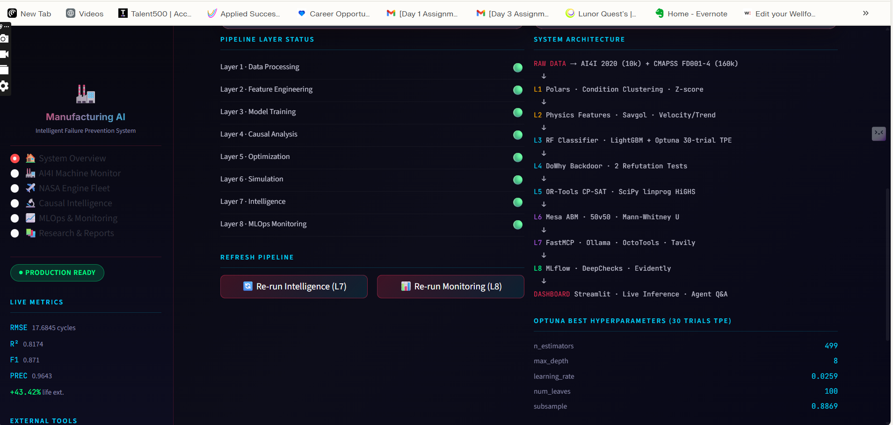
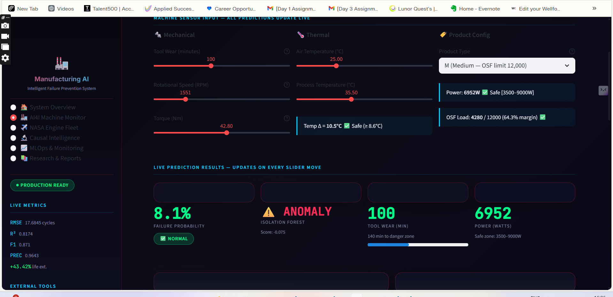
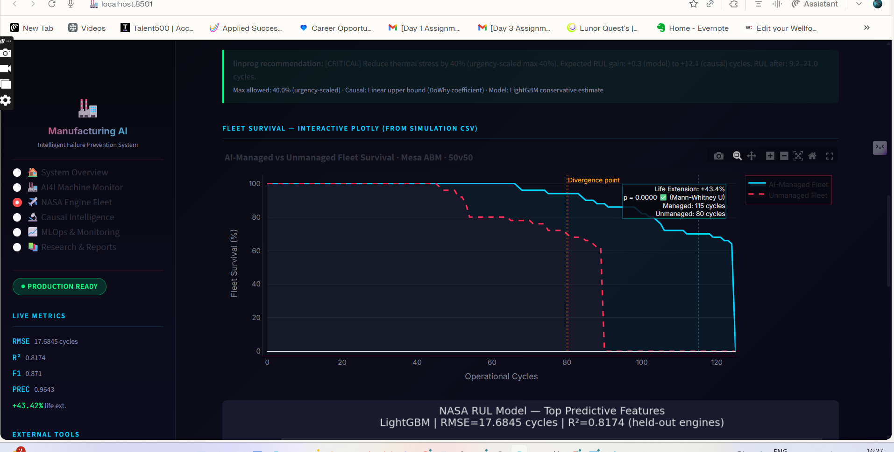
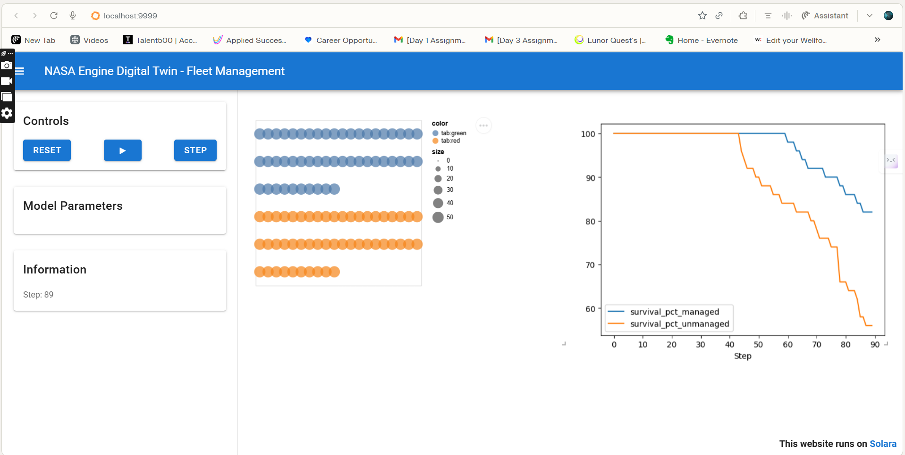
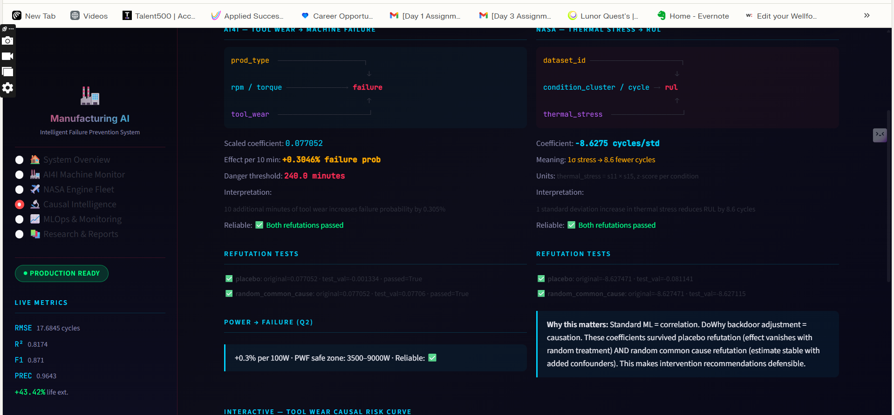
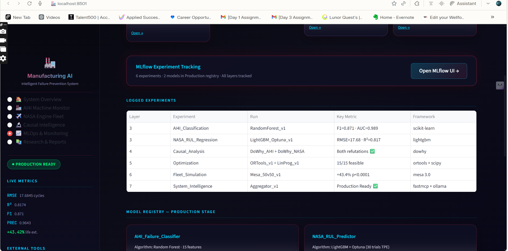
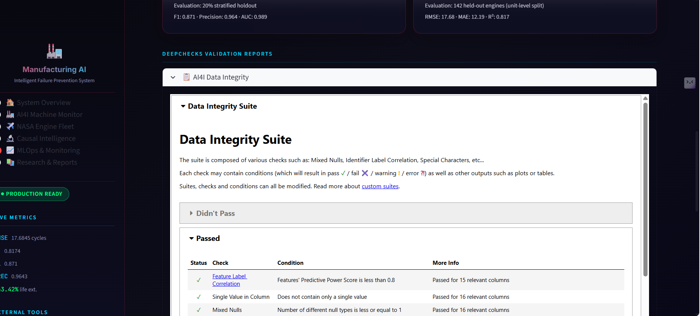
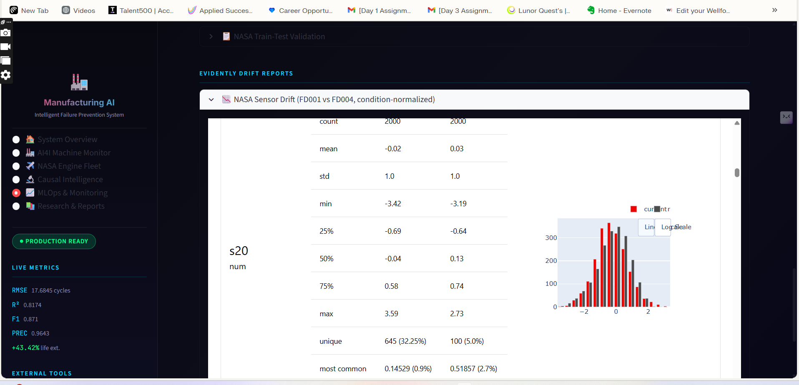
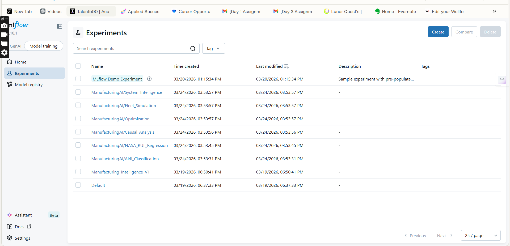
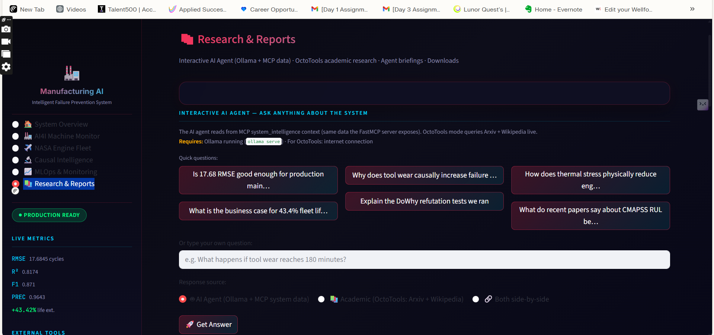